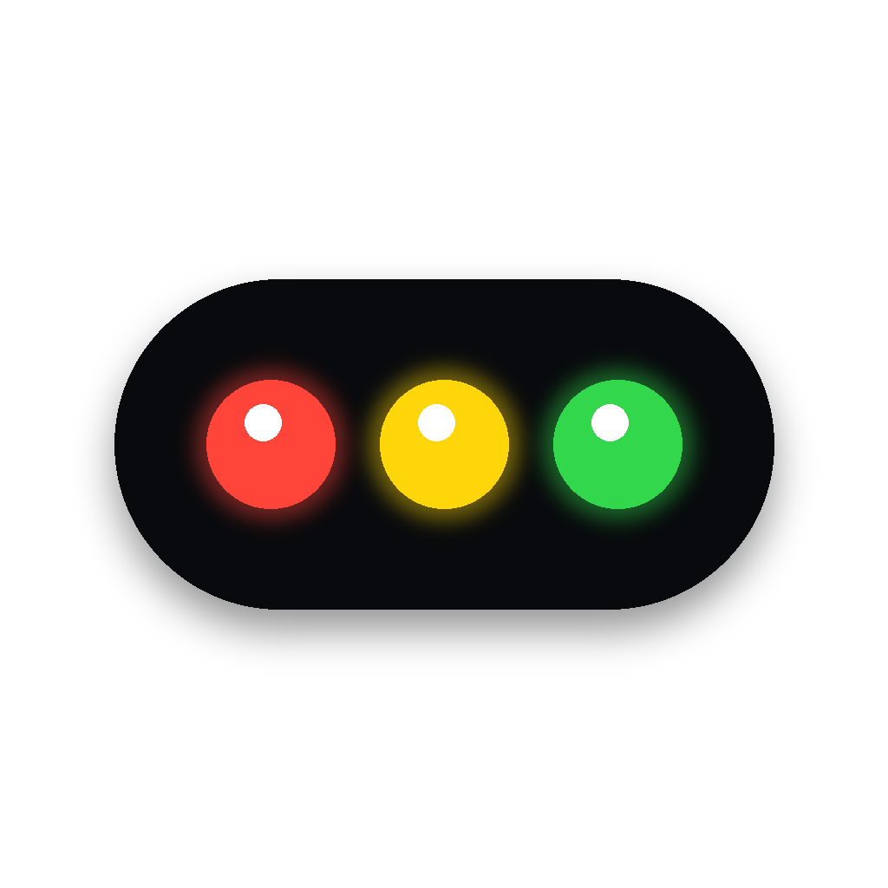

# AgentLight

A lightweight Electron overlay that shows all your running Claude Code, Codex, and Cursor AI agent sessions in a sleek top-of-screen status bar.



## Features

- **Live session tracking** — See all running AI coding sessions at a glance
- **Status indicators** — Color-coded dots: yellow (running), red (waiting for input), green (completed)
- **System sounds** — Audible alerts on status changes
- **Multi-client support** — Works with Claude Code, OpenAI Codex, and Cursor
- **Auto-collapse** — Bar shrinks to dots after a few seconds; expands on hover
- **Tray controls** — Right-click tray icon to toggle sounds or quit
- **One-click focus** — Click any session pill to bring its terminal to the front

## Installation

**Prerequisites:** Node.js 18+, macOS (arm64 or x64)

```bash
git clone https://github.com/FOkvj/AgentLight.git
cd AgentLight
npm install
```

### Install hooks (connects AI clients to AgentLight)

```bash
npm run install-hooks
```

This configures hooks for Claude Code, Codex, and Cursor automatically.

### Run from source

```bash
npm start
```

### Build macOS app

```bash
npm run package
```

The `.app` bundle will be in `dist/`.

## How it works

Each AI client (Claude Code, Codex, Cursor) fires lifecycle hook events (`UserPromptSubmit`, `PreToolUse`, `PostToolUse`, `Stop`). The hooks in `hooks/` forward these events over HTTP to AgentLight's local server (port 27420), which updates the overlay in real time.

```
AI Client → hook script → POST /event → Electron app → overlay UI
```

AgentLight auto-launches when the first hook fires if it's not already running.

## Project structure

```
hooks/
  claude-hook.sh    # Claude Code hook
  codex-hook.sh     # Codex hook
  cursor-hook.sh    # Cursor hook
scripts/
  install-hooks.js  # Hook installer
  package-mac.js    # macOS app packager
renderer/
  index.html
  app.js
  styles.css
main.js             # Electron main process + HTTP server
preload.js          # Electron preload bridge
```

## License

MIT
